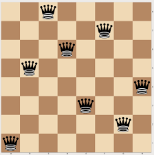

# N Queens

## Overview
The "N Queens" project is a programming challenge that tackles the classic problem in computer science and mathematics of placing N non-attacking queens on an N×N chessboard. This problem is an excellent exercise in algorithmic thinking, specifically in the implementation of backtracking algorithms.The project showcases the elegance of Python programming, particularly in its support for recursion, list manipulations, and command-line argument handling. 

## Problem statement
Given an N×N chessboard, the task is to place N queens on the board such that no two queens attack each other. Queens can attack each other if they share the same row, column, or diagonal. The objective is to find all possible configurations of queen placements on the board that satisfy these conditions.

## Approach
The project requires an understanding of backtracking algorithms, which are a powerful technique for solving problems with a large search space. Backtracking involves systematically exploring all potential solutions to a problem and backtracking when a solution cannot be completed.

In the context of the N Queens problem, the backtracking algorithm works by placing queens on the board, one at a time, and checking if the current configuration is valid. If a queen can be placed without attacking any other queen, the algorithm proceeds to place the next queen. If no valid position is found for the current queen, the algorithm backtracks and tries a different position for the previous queen.

## Implementation
The implementation of the N Queens problem typically involves recursion to explore all possible configurations of queen placements. Recursive functions are used to place queens on the board and check for conflicts with existing queens. Lists are commonly employed to represent the board and store the positions of queens.

Additionally, the project may require handling command-line arguments for input parameters such as the size of the chessboard (N).

## Key concepts
- Backtracking Algorithms
- Recursion
- List Manipulation in Python
- Python Command Line Arguments

## Task:
File:
    
    - 0-nqueens.py
The N queens puzzle is the challenge of placing N non-attacking queens on an N×N chessboard. Write a program that solves the N queens problem.

- Usage: nqueens N
    If the user called the program with the wrong number of arguments, print Usage: nqueens N, followed by a new line, and exit with the status 1

- where N must be an integer greater or equal to 4
    If N is not an integer, print N must be a number, followed by a new line, and exit with the status 1
    If N is smaller than 4, print N must be at least 4, followed by a new line, and exit with the status 1

- The program should print every possible solution to the problem
    One solution per line
    Format: see example
    You don’t have to print the solutions in a specific order
    You are only allowed to import the sys module