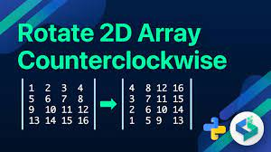

# Rotate 2D Matrix

## Description
This project focuses on implementing an in-place algorithm to rotate an n x n 2D matrix by 90 degrees clockwise. It involves rearranging the elements of the matrix without creating a copy, thereby optimizing space complexity. Through this project, harnesses the concepts of matrix transposition, row reversal techniques, and nested loop iteration.

## Learning objectives
-`Matrix Representation`: Understand how Python represents 2D matrices using lists of lists and learn to manipulate them effectively.
-`In-place Operations`: Master the art of performing operations directly on data structures to minimize space usage.
-`Algorithm Optimization`: Explore strategies to optimize algorithms for efficiency and performance.
-`Problem-solving Skills`: Hone your ability to break down complex problems into manageable steps and develop systematic solutions.
-`Python Proficiency`: Enhance your proficiency in Python programming, including coding style adherence and documentation practices.

## Task
Filename:

    - 0-rotate_2d_matrix.py
Given an n x n 2D matrix, rotate it 90 degrees clockwise.

- Prototype: def rotate_2d_matrix(matrix):
- Do not return anything. The matrix must be edited in-place.
- You can assume the matrix will have 2 dimensions and will not be empty.